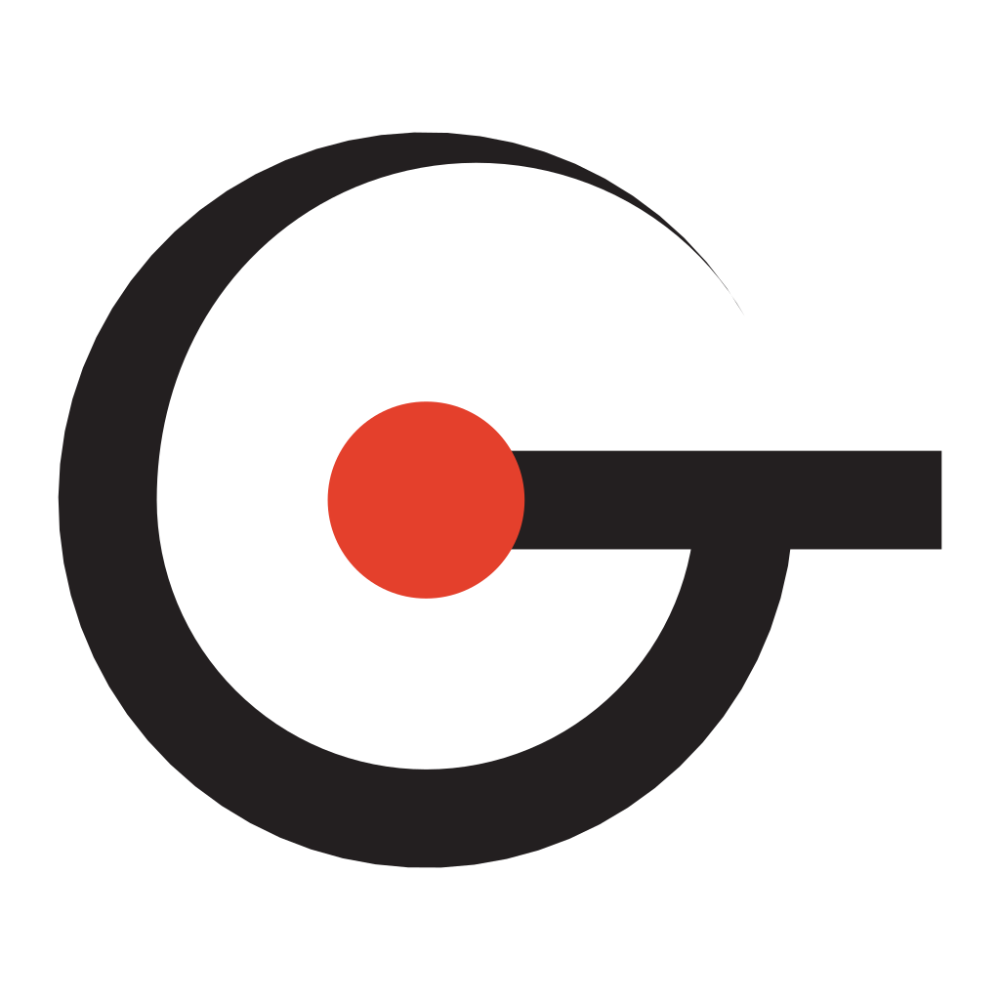

# AIMS (Archery Integrated Management System)

## Purpose

"To provide every archer with the premier tracking experience, growing together with peers through score analysis and sharing."

> 「すべてのアーチャーに最高の記録体験を提供し、スコアの分析と共有を通じて仲間とともに成長できる環境を実現する」

## Core Values

### 1. Tracking Experience without Stress

From those who just want to log total scores to those who wish to track every single arrow, we deliver the fastest possible experience for users to record exactly what they need.

### 2. Community Building through Score Sharing

By enabling users to freely choose their teams and share scores, we streamline management for existing organizations while fostering peer-to-peer sharing and the creation of new communities.

### 3. Fostering Growth through Data Analytics

By analyzing score trends and shot distributions, we pinpoint specific challenges to drive continuous growth for both individual archers and the entire team.

> **1. ストレスフリーな記録体験**  
> 合計点だけ記録したい人から、矢ごとの的中を記録したい人まで、すべてのユーザーが記録したい内容を最速で記録できる体験を提供する。
>
> **2. スコア共有を通じたコミュニティ形成**  
> 個々のユーザーが自由に所属するチームを選び、スコアを共有できる環境を実現することで、既存団体におけるスコア管理はもちろん、個人間のスコア共有や新たなコミュニティの形成を支援する。
>
> **3. データ分析を通じた成長支援**  
> 記録したスコアから得点推移や的中分布を分析し、課題を明確にすることで、個人とチーム全体の継続的な成長を支援する。

## About the Name

The name AIMS carries a philosophy: to take precise aim at the challenges users face, and to support them, from their own point of view, all the way to their goals.

> サービス名のAIMSには、ユーザーが直面する課題に的確に狙いを定め、ユーザー目線で目標達成まで支援するという理念を込めている。

## About the Icon

The AIMS logo takes its motif from the archery sight used to take aim, carrying — just like the service name — a philosophy of taking precise aim at the challenges users face and supporting them, from their own point of view, all the way to their goals. The smooth, streamlined ring symbolizes the stress-free recording the service provides, and reflects the continuous growth it supports through data analysis. The red circle at its center represents the circle of community where peers come together and share.

> AIMSのロゴはアーチェリーで狙いを定めるためのサイトをモチーフにしており、サービス名と同様に、ユーザーが直面する課題に的確に狙いを定め、ユーザー目線で目標達成まで支援するという理念を込めている。滑らかな流線型の円環はサービスが提供するストレスフリーな記録を象徴し、データ分析を通じた継続的な成長支援を示している。中央の赤い円は仲間が集まり共有し合うコミュニティの輪を表現している。

## Contribution

Please read the [contribution guidelines](CONTRIBUTING.md) before contributing to this project.

## Tech Stack

| Category | Technology | Key Rationale |
| :--- | :--- | :--- |
| **Application** | Next.js (TypeScript) | Full-stack type safety without separate native apps |
| | Supabase (PostgreSQL) | Advanced SQL analytics, built-in Auth, and RLS |
| | Tailwind CSS, shadcn/ui | Consistent styling suited for AI-assisted development |
| **Infrastructure** | Vercel | Seamless Next.js deployment with automatic PR previews |
| | Cloudflare | At-cost registrar and DNS managed in one dashboard |
| | Resend | High deliverability and reliable Supabase Auth integration |
| **Testing** | Vitest | Fast feedback loop for pure scoring & calculation logic |
| | pgTAP | Direct validation of Row Level Security policies at DB layer |
| | Playwright | E2E regression guardrail for critical user flows |
| **Tooling** | pnpm | Strict dependency resolution with fast caching in CI / local |
| | Biome | Ultra-fast linting acting as a guardrail for code consistency |

## License

AIMS is licensed under the [GNU Affero General Public License v3.0 or later](LICENSE) (AGPL-3.0-or-later). If you run a modified version of this project as a network service, the AGPL requires that you make your modified source available to its users.
