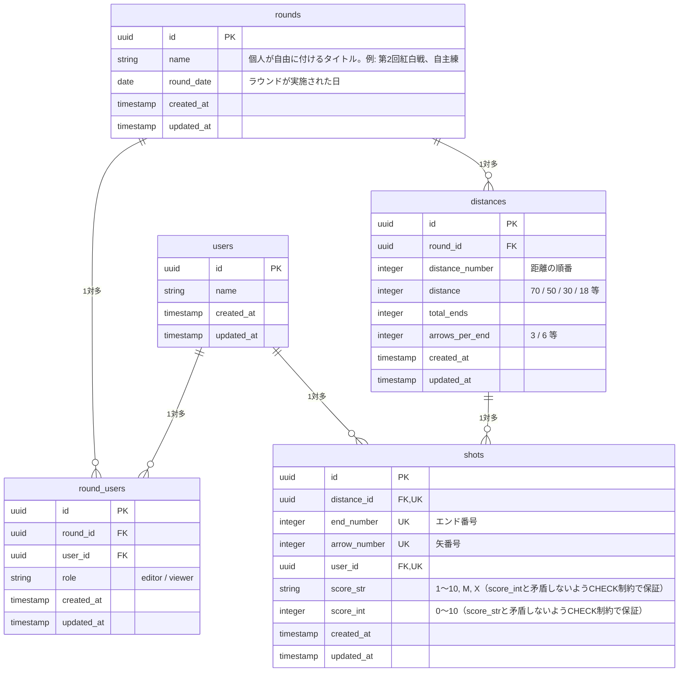

# ERD（エンティティ関連図）

| テーブル名     | 説明                                                                             |
| :------------ | :------------------------------------------------------------------------------ |
| `users`       | ユーザーの基本プロフィール情報を保持する                                            |
| `rounds`      | アーチェリーの記録単位となる「ラウンド」を表す。距離構成は`distances`が持つ                |
| `round_users` | 特定のラウンドに対するユーザーのアクセス権限・ロールを管理する                        |
| `distances`   | ラウンド中に射撃する特定の距離を表す                                                |
| `shots`       | 個々の矢のスコアと属性を記録する                                                    |

---

- `shots`は`(distance_id, user_id, end_number, arrow_number)`に一意制約を持ち、この4列をキーにupsertする。
- ラウンド作成は`create_round(name, round_date, distances)` RPC（`SECURITY DEFINER`）経由でのみ行う。`round_users`への登録・`rounds`・`distances`の作成をこの関数内で順に行い、原子性を保つ。`rounds`への直接INSERTは許可しない（詳細は[docs/security.md](./security.md)参照）。
- 「距離・的の種類・的のサイズ」などラウンドの競技形式を細かく区別する要素は実際には非常に多岐にわたるため、v0.2.0（PoC）では意図的に対象外とし、`rounds`は記録単位としての名前と実施日のみを持つ。的管理・定型ラウンド選択はv1.0.0（MVP）で導入予定（[docs/roadmap.md](./roadmap.md)参照）。
