# Entity Relationship Diagram (実体関連図)

> この図はイベントソーシングを含むデータベース設計を示す。実装状況は以下に記載する。
> **今回の実装**：`shots.shooter_id`への改名、矢の位置・ラウンド内の距離番号・プリセット内の距離番号の一意制約、リングの`z_index`一意制約の撤廃。
> **未実装**：3種類のイベントテーブル、`version`・`effective_at`、`disabled_at`・`cleared_at`、イベントの受信・射影・永続化。これらは今回のマイグレーションには含まれない。
>
> **共通の日時方針**：`users`を含む全テーブルで`created_at`・`updated_at`を必須とする。`created_at`は行作成時、`updated_at`は行更新時の物理書き込み時刻を`clock_timestamp()`で記録する。`updated_at`は全テーブルの更新トリガーで自動更新される。追記専用イベントの日時列の扱いも実装時にこの共通方針と整合させる。`effective_at`はこれらと異なる、競合判定に使う補正済み操作時刻である。
>
> **現在の入力UI**：新規入力ではログインユーザーを射手とし、既存の矢の点数修正・Undo/Redoでは射手を保持する。射手選択UIは未実装。編集権限は射手ではなく`round_users.role`で判定する。
>
> `UK`は列単独の一意性ではなく、説明に示す複合キーを構成することを表す。
| テーブル名                  | 説明                                                                             |
| :------------------------ | :------------------------------------------------------------------------------ |
| `users`                   | ユーザーの基本プロフィール情報を保持する。このアプリの利用者は全員アーチェリーの競技者（アーチャー）であり、役割による区別は無い |
| `rounds`                  | アーチェリーの記録単位となる「ラウンド」（1回の練習・試合セッション）を表す。距離構成は`distances`が持つ |
| `round_users`             | 特定のラウンドに対するユーザーのアクセス権限・ロールを管理する多対多の中間テーブル。1ラウンドに複数のeditor/viewerが存在しうる |
| `distances`               | ラウンド中に射撃する特定の距離（70m、50m等）を表す。1ラウンドに複数の距離を持てる            |
| `shots`                   | 個々の矢のスコアと、誰が射ったかを記録する。1つの(距離, エンド, 矢番号)は常に1本の矢を指す      |
| `target_faces`            | 的（ターゲットフェイス）を表す。`owner_id`がnullならグローバル（全ユーザー共通）、値があれば個人登録   |
| `target_face_spots`       | 的の中の的中スポット（中心座標）を表す。1つの的が複数スポットを持てる（3つ目等の複数的配置）   |
| `target_face_rings`       | スポットの中の点数帯（同心円1本）を表す。半径・色・重なり順・得点を持つ                    |
| `round_presets`           | ラウンドの定型フォーマット（種別・弓種・距離構成）を表す。`owner_id`がnullならグローバル、値があれば個人プリセット |
| `round_preset_distances`  | `round_presets`が持つ距離構成の1行を表す                                            |
| `round_events` | `rounds`への変更を表す追記専用イベントログ。書き込みの正。削除・修正は行わない          |
| `distance_events` | `distances`への変更を表す追記専用イベントログ。書き込みの正。削除・修正は行わない     |
| `shot_events` | `shots`への変更を表す追記専用イベントログ。書き込みの正。削除・修正は行わない            |

---

```mermaid
erDiagram
    users ||--o{ round_users : "1対多"
    rounds ||--o{ round_users : "1対多"
    rounds ||--o{ distances : "1対多"
    distances ||--o{ shots : "1対多"
    users ||--o{ shots : "1対多（射手）"
    users ||--o{ target_faces : "1対多（owner）"
    target_faces ||--o{ target_face_spots : "1対多"
    target_face_spots ||--o{ target_face_rings : "1対多"
    target_faces ||--o{ distances : "1対多（参照）"
    users ||--o{ round_presets : "1対多（owner）"
    round_presets ||--o{ round_preset_distances : "1対多"
    target_faces ||--o{ round_preset_distances : "1対多（参照）"
    rounds ||--o{ round_events : "1対多"
    rounds ||--o{ distance_events : "1対多"
    rounds ||--o{ shot_events : "1対多"
    users ||--o{ round_events : "1対多（author）"
    users ||--o{ distance_events : "1対多（author）"
    users ||--o{ shot_events : "1対多（author）"
    users ||--o{ shot_events : "1対多（射手）"

    users {
        uuid id PK "auth.users.idと同一。認証基盤側のアカウントに1対1で対応する"
        string name "表示名。ユーザー自身が設定する"
        timestamp created_at "アカウント作成時刻"
        timestamp updated_at "行の最終更新時刻（共通方針と未実装事項は冒頭参照）"
    }
    rounds {
        uuid id PK "サロゲートID。distances/shots/round_users等から参照される"
        string name "個人が自由に付けるタイトル。例: 第2回紅白戦、自主練"
        date round_date "ラウンドが実施された日（記録日。作成日時とは別）"
        string format "outdoor / indoor / field。距離構成の単位（m/cm）や採点ルールに影響する"
        string bow_type "recurve / compound / barebow。弓種によって的・ルールが変わりうる"
        bigint version "楽観的並行性制御。round_eventsの適用ごとに+1。初期値0"
        timestamp effective_at "Layer2タイブレーク用の比較基準。LEAST(occurred_at, created_at)"
        timestamp created_at "この行がDBに作られた時刻（create_round RPC実行時）"
        timestamp updated_at "行の最終更新時刻（共通方針と未実装事項は冒頭参照）"
    }
    round_users {
        uuid id PK "サロゲートID"
        uuid round_id FK, UK "対象ラウンド"
        uuid user_id FK, UK "メンバーとして登録されるユーザー。(round_id, user_id)で一意"
        string role "editor（記録・編集可）/ viewer（閲覧のみ）。CHECK制約で2値に限定"
        timestamp created_at "メンバー登録時刻"
        timestamp updated_at "行の最終更新時刻（共通方針と未実装事項は冒頭参照）"
    }
    distances {
        uuid id PK "サロゲートID。shots.distance_id等から参照される"
        uuid round_id FK, UK "所属するラウンド。(round_id, distance_number)で一意"
        integer distance_number UK "意味を持つ値（end_number等と同格）。何番目に射撃する距離かを表し、クライアントが指定する。自動採番しない"
        integer distance "70 / 50 / 30 / 18 等（m）。1以上。is_marked=falseの場合はnull可（アンマークド）"
        integer total_ends "このディスタンスの総エンド数。1以上"
        integer arrows_per_end "1エンドあたりの矢数（3 / 6 等）。1以上"
        uuid target_face_id FK "使用する的の種類"
        boolean is_marked "既定true。falseはアンマークド（フィールド等で距離が公開されない形式）"
        timestamp disabled_at "論理削除。ハードデリート廃止によりnullable。nullなら有効"
        bigint version "楽観的並行性制御。distance_eventsの適用ごとに+1"
        timestamp effective_at "Layer2タイブレーク用の比較基準"
        timestamp created_at "この行がDBに作られた時刻"
        timestamp updated_at "行の最終更新時刻（共通方針と未実装事項は冒頭参照）"
    }
    shots {
        uuid id PK "サロゲートID"
        uuid distance_id FK, UK "所属する距離。(distance_id, end_number, arrow_number)で一意"
        integer end_number UK "エンド番号。1つのdistance内で1始まりの連番"
        integer arrow_number UK "矢番号。1エンド内で1始まりの連番"
        uuid shooter_id FK "射った本人。記録・編集した人（author）とは別概念。shot_events.shooter_idを、適用のたびに反映する"
        string score_str "1〜10, M（ミス）, X（インナー10）。クリア後も直前の値を保持する（disabled_atと同じ考え方）"
        integer score_int "0〜10。score_strと対応するCHECK制約あり。クリア後の扱いは同上"
        timestamp cleared_at "論理削除。distances.disabled_atと同じ考え方。nullなら現在有効なスコア"
        bigint version "楽観的並行性制御。shot_eventsの適用ごとに+1"
        timestamp effective_at "Layer2タイブレーク用の比較基準"
        timestamp created_at "この行がDBに作られた時刻（最初にこの矢が記録された時刻）"
        timestamp updated_at "行の最終更新時刻（共通方針と未実装事項は冒頭参照）"
    }
    target_faces {
        uuid id PK "サロゲートID"
        uuid owner_id FK "null=グローバル（全ユーザー共通の公式的）、値があれば個人登録"
        string name "的の名称"
        bigint size "的紙の実サイズ（cm）。6点的等はリング最外径と一致しない"
        string format "outdoor/indoor/field。的選択UIの並び順に使う"
        string_array bow_type "recurve/compound/barebow。対応する弓種（複数可、非空）"
        timestamp created_at "登録時刻"
        timestamp updated_at "行の最終更新時刻（共通方針と未実装事項は冒頭参照）"
    }
    target_face_spots {
        uuid id PK "サロゲートID"
        uuid target_face_id FK "所属する的"
        numeric center_x "的紙全体の原点からのオフセット（cm単位）。単一スポットの的は(0,0)"
        numeric center_y "同上"
        timestamp created_at "登録時刻"
        timestamp updated_at "行の最終更新時刻（共通方針と未実装事項は冒頭参照）"
    }
    target_face_rings {
        uuid id PK "サロゲートID"
        uuid spot_id FK "所属するスポット"
        numeric radius "そのリングの外側半径（cm単位）"
        string color "塗り色（HEX）"
        string line_color "境界線の色（HEX）。null=境界線を描画しない"
        integer z_index "target_face全体で共通の重なり順。描画順のみに使う値で、一意制約なし（重複は許容される）"
        string score_str "X, 10, 9 等。このリング内に刺さった場合の点数"
        integer score_int "0〜10。score_strと対応"
        timestamp created_at "登録時刻"
        timestamp updated_at "行の最終更新時刻（共通方針と未実装事項は冒頭参照）"
    }
    round_presets {
        uuid id PK "サロゲートID"
        uuid owner_id FK "null=グローバル（公式プリセット）、値があれば個人プリセット"
        string name "70W / SH / WA1440 等、フォーマットの通称"
        string format "outdoor / indoor / field"
        string bow_type "recurve / compound / barebow"
        timestamp created_at "登録時刻。プリセット一覧のソートに実際に使われている"
        timestamp updated_at "行の最終更新時刻（共通方針と未実装事項は冒頭参照）"
    }
    round_preset_distances {
        uuid id PK "サロゲートID"
        uuid preset_id FK, UK "所属するプリセット。(preset_id, distance_number)で一意"
        integer distance_number UK "何番目の距離か。distances.distance_numberと同じ意味"
        integer distance "1以上。is_marked=falseの場合はnull可"
        integer total_ends "1以上"
        integer arrows_per_end "1以上"
        uuid target_face_id FK "使用する的の種類"
        boolean is_marked "既定true。distancesと同じ意味"
        timestamp created_at "登録時刻"
        timestamp updated_at "行の最終更新時刻（共通方針と未実装事項は冒頭参照）"
    }
    round_events {
        uuid event_id PK "クライアント生成UUID。冪等性キー（同じevent_idの再送はappend時に無視される）"
        uuid round_id FK "対象ラウンド。rounds.versionで楽観的並行性制御される"
        string name "型は1種類（ラウンド設定更新）のみのためtype列は無い"
        date round_date
        string format "outdoor / indoor / field"
        string bow_type "recurve / compound / barebow"
        timestamp occurred_at "クライアント申告時刻。LWW判定に使うが物理時計をそのまま信用はしない"
        bigint expected_version "クライアントが編集の前提とした版。rounds.versionと一致すればLayer1適用"
        uuid author_id FK "この操作を送信した人（監査用）"
        timestamp created_at "サーバー受領時刻。clock_timestamp()（呼び出し時の時刻。同値や時計の逆行を排除するものではない）"
    }
    distance_events {
        uuid event_id PK "クライアント生成UUID。冪等性キー"
        uuid round_id FK "対象ラウンド"
        uuid distance_id "サロゲートID。distances.idのFKではない（射影行が未作成でもイベントを記録できるようにするため。認可・入力検証は別途必要）"
        integer distance_number "自然キーの一部。round_idと組でdistancesの対象行を特定する"
        string type "DISTANCE_CREATED / DISTANCE_UPDATED / DISTANCE_DISABLED"
        integer distance "CREATED/UPDATEDで指定。is_marked=falseならnull可。DISABLEDはnull"
        boolean is_marked "同上"
        integer total_ends "同上"
        integer arrows_per_end "同上"
        uuid target_face_id "同上。distances.target_face_idと同じ制約だがFKにはしない（同上の理由）"
        timestamp occurred_at "クライアント申告時刻"
        bigint expected_version "distances.versionと一致すればLayer1適用"
        uuid author_id FK "この操作を送信した人（監査用）"
        timestamp created_at "サーバー受領時刻。clock_timestamp()"
    }
    shot_events {
        uuid event_id PK "クライアント生成UUID。冪等性キー"
        uuid round_id FK "対象ラウンド"
        uuid distance_id "distances.idのFKではない（同上の理由）"
        integer end_number "自然キーの一部"
        integer arrow_number "自然キーの一部"
        string type "SHOT_RECORDED / SHOT_CLEARED"
        uuid shooter_id FK "射った本人。RECORDEDで必須、クライアントが明示的に指定する（代理入力を想定し、author_idとは独立）"
        string score_str "RECORDEDのみ必須。CLEAREDはnull。shots.score_strと同じCHECK制約"
        integer score_int "同上"
        timestamp occurred_at "クライアント申告時刻"
        bigint expected_version "shots.versionと一致すればLayer1適用"
        uuid author_id FK "この操作を送信した人（監査用）。コーチが代理入力する場合等、shooter_idと異なりうる"
        timestamp created_at "サーバー受領時刻。clock_timestamp()"
    }
```

