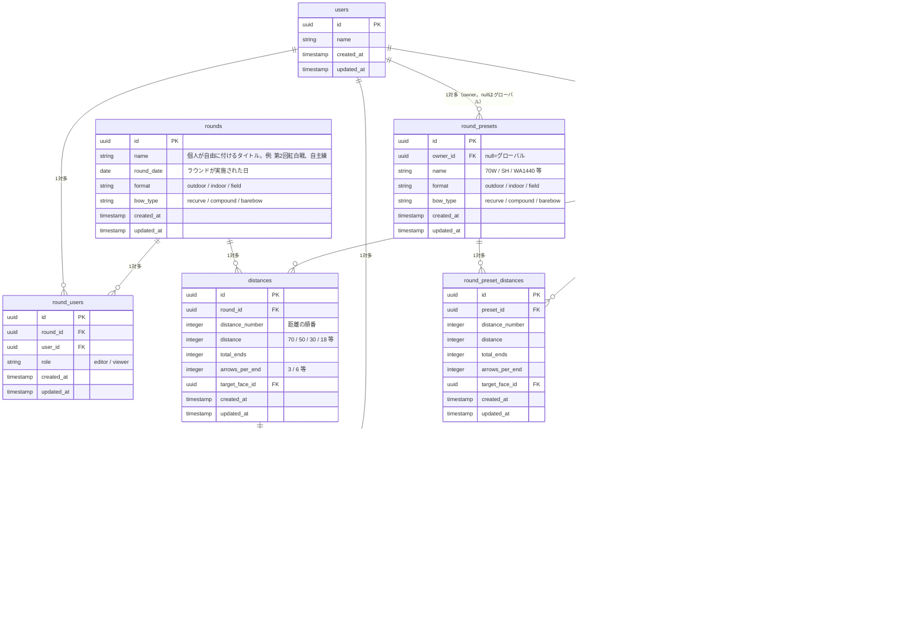

# ERD（エンティティ関連図）

| テーブル名                  | 説明                                                                             |
| :------------------------ | :------------------------------------------------------------------------------ |
| `users`                   | ユーザーの基本プロフィール情報を保持する                                            |
| `rounds`                  | アーチェリーの記録単位となる「ラウンド」を表す。距離構成は`distances`が持つ                |
| `round_users`             | 特定のラウンドに対するユーザーのアクセス権限・ロールを管理する                        |
| `distances`               | ラウンド中に射撃する特定の距離を表す                                                |
| `shots`                   | 個々の矢のスコアと属性を記録する                                                    |
| `target_faces`            | 的（ターゲットフェイス）を表す。`owner_id`がnullならグローバル（全ユーザー共通）、値があれば個人登録   |
| `target_face_spots`       | 的の中の的中スポット（中心座標）を表す。1つの的が複数スポットを持てる（3つ目等の複数的配置）   |
| `target_face_rings`       | スポットの中の点数帯（同心円1本）を表す。半径・色・重なり順・得点を持つ                    |
| `round_presets`           | ラウンドの定型フォーマット（種別・弓種・距離構成）を表す。`owner_id`がnullならグローバル、値があれば個人プリセット |
| `round_preset_distances`  | `round_presets`が持つ距離構成の1行を表す                                            |

---

- `shots`は`(distance_id, user_id, end_number, arrow_number)`に一意制約を持ち、この4列をキーにupsertする。
- ラウンド作成は`create_round(name, round_date, distances)` RPC（`SECURITY DEFINER`）経由でのみ行う。`round_users`への登録・`rounds`・`distances`の作成をこの関数内で順に行い、原子性を保つ。`rounds`への直接INSERTは許可しない（詳細は[docs/security.md](./security.md)参照）。`p_distances`に`target_face_id`、`rounds`に`format`/`bow_type`を追加する形でこの関数を拡張する。
- 的・ラウンド構成管理（[docs/roadmap.md](./roadmap.md)のv1.0.0参照）の設計方針は以下の通り。
  - **的（`target_faces`〜`target_face_rings`）**: 画像ではなく幾何情報（スポットの中心座標、点数帯の半径・色・重なり順・得点）で的を管理する。これにより (1) 点数帯の色をスコア入力キーパッドの配色に流用できる（[Issue #132](https://github.com/yukiyamasaki6/aims/issues/132)）、(2) 将来的に的をクリックして記録する体験や着弾位置に基づく分析（[docs/roadmap.md](./roadmap.md)の着弾位置プロット、v1.6.0）にも同じデータを再利用できる、というねらいがある。「スポット」は物理的に離れた複数的（3つ目等）だけでなく、同一の的内で中心がずれたリング（実験的な的）も区別なく表現できる。
  - **ラウンド（`rounds.format`/`rounds.bow_type`、`distances.target_face_id`）**: ラウンドは種別（`format`: outdoor/indoor/field）・弓種（`bow_type`: recurve/compound/barebow）・距離の組み合わせ（`distances`の並び）・的の種類（距離ごとの`target_face_id`）の4軸で構成される。種別・弓種は1ラウンド内で変化しないため`rounds`に、的は距離ごとに変わりうるため`distances`に持つ。
  - **プリセット（`round_presets`/`round_preset_distances`）**: 種別・弓種・距離の組み合わせ・的をまとめたテンプレート。グローバルプリセット（70W, SH, WA1440等の公式ラウンド名、マイグレーションでシード）と個人プリセット（`owner_id`を自分にして保存）を同一テーブルで扱う。
