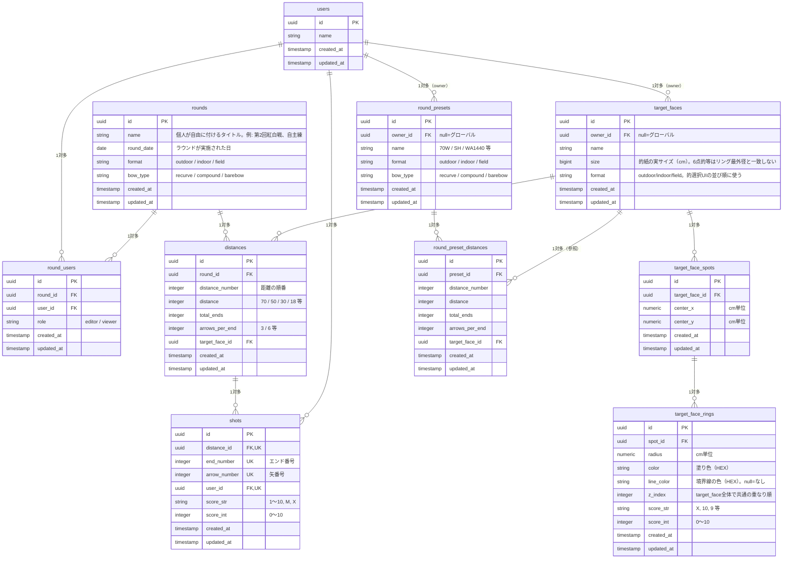

# ERD（エンティティ関連図）

| テーブル名                  | 説明                                                                             |
| :------------------------ | :------------------------------------------------------------------------------ |
| `users`                   | ユーザーの基本プロフィール情報を保持する                                            |
| `rounds`                  | アーチェリーの記録単位となる「ラウンド」を表す。距離構成は`distances`が持つ                |
| `round_users`             | 特定のラウンドに対するユーザーのアクセス権限・ロールを管理する                        |
| `distances`               | ラウンド中に射撃する特定の距離を表す                                                |
| `shots`                   | 個々の矢のスコアと属性を記録する                                                    |
| `target_faces`            | 的（ターゲットフェイス）を表す。`owner_id`がnullならグローバル（全ユーザー共通）、値があれば個人登録   |
| `target_face_spots`       | 的の中の的中スポット（中心座標）を表す。1つの的が複数スポットを持てる（3つ目等の複数的配置）   |
| `target_face_rings`       | スポットの中の点数帯（同心円1本）を表す。半径・色・重なり順・得点を持つ                    |
| `round_presets`           | ラウンドの定型フォーマット（種別・弓種・距離構成）を表す。`owner_id`がnullならグローバル、値があれば個人プリセット |
| `round_preset_distances`  | `round_presets`が持つ距離構成の1行を表す                                            |

---

