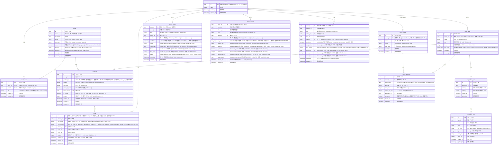

# Entity Relationship Diagram (実体関連図)

| テーブル名                  | 説明                                                                             |
| :------------------------ | :------------------------------------------------------------------------------ |
| `users`                   | ユーザーの基本プロフィール情報を保持する。 |
| `rounds`                  | アーチェリーの記録単位となる「ラウンド」（1回の練習・試合セッション）を表す。距離構成は`distances`が持つ |
| `round_users`             | 特定のラウンドに対するユーザーのアクセス権限・ロールを管理する多対多の中間テーブル。1ラウンドに複数のeditor/viewerが存在しうる |
| `distances`               | ラウンド中に射撃する特定の距離（70m、50m等）を表す。1ラウンドに複数の距離を持てる            |
| `shots`                   | 1行が1本の矢で、点数・射手・射順を記録する。矢はIDで識別し、表示の位置・射順・点数に依存しない。エンドの生きている矢は矢数を超えない |
| `round_events` | `rounds`への変更を表す追記専用イベントログ。書き込みの正。削除・修正は行わない。効かせた操作の、効いた項目だけを記録する |
| `distance_events` | `distances`への変更を表す追記専用イベントログ。書き込みの正。削除・修正は行わない。効かせた操作の、効いた項目だけを記録する |
| `shot_events` | `shots`への変更を表す追記専用イベントログ。書き込みの正。削除・修正は行わない            |
| `target_faces`            | 的を表す。`owner_id`がnullならグローバル、値があれば個人登録   |
| `target_face_spots`       | 的の中の的中スポット（中心座標）を表す。1つの的が複数スポットを持てる（3つ目等の複数的配置）   |
| `target_face_rings`       | スポットの中の点数帯（同心円1本）を表す。半径・色・重なり順・得点を持つ                    |
| `preset_rounds`           | ラウンドの定型フォーマット（種別・弓種・距離構成）を表す。`owner_id`がnullならグローバル、値があれば個人プリセット |
| `preset_distances`        | `preset_rounds`が持つ距離構成の1行を表す                                             |

---

```mermaid
erDiagram
    users ||--o{ round_users : "1対多"
    rounds ||--o{ round_users : "1対多"
    rounds ||--o{ distances : "1対多"
    distances ||--o{ shots : "1対多"
    users ||--o{ shots : "1対多"
    users ||--o{ target_faces : "1対多"
    target_faces ||--o{ target_face_spots : "1対多"
    target_face_spots ||--o{ target_face_rings : "1対多"
    target_faces ||--o{ distances : "1対多"
    users ||--o{ preset_rounds : "1対多（owner）"
    preset_rounds ||--o{ preset_distances : "1対多"
    target_faces ||--o{ preset_distances : "1対多"
    users ||--o{ round_events : "1対多"
    users ||--o{ distance_events : "1対多"
    users ||--o{ shot_events : "1対多"

    users {
        uuid id PK "auth.users.idと同一。認証基盤側のアカウントと1対1対応"
        string name "表示名"
        timestamp created_at "作成時刻"
        timestamp updated_at "最終更新時刻"
    }
    rounds {
        uuid id PK "サロゲートID"
        string name "タイトル（例: 第2回紅白戦、自主練）"
        date round_date "記録日"
        string format "種別 [CHECK: outdoor / indoor / field]"
        string bow_type "弓種 [CHECK: recurve / compound / barebow]"
        string status "状態 [NOT NULL] [DEFAULT: in_progress] [CHECK: in_progress / completed]"
        bigint revision "現在のサーバー確定リビジョン [NOT NULL] [CHECK: >= 1]"
        timestamp disabled_at "論理削除時刻 [NULLABLE: null=有効、値あり=無効]"
        timestamp created_at "作成時刻"
        timestamp updated_at "最終更新時刻"
    }
    round_users {
        uuid id PK "サロゲートID"
        uuid round_id FK, UK "対象ラウンド [UK: (round_id, user_id)]"
        uuid user_id FK, UK "対象ユーザ [UK: (round_id, user_id)]"
        string role "ユーザのラウンドへのアクセス権限 [CHECK: editor / viewer]"
        timestamp created_at "作成時刻"
        timestamp updated_at "最終更新時刻"
    }
    distances {
        uuid id PK "サロゲートID"
        uuid round_id FK "所属ラウンド"
        string position_key "ラウンド内の並び順を表す可変長キー。重複を許し、同じキーはIDで順序を決める。表示番号は(position_key, id)順から導出"
        integer distance "距離（m） [CHECK: > 0] [NULLABLE: is_marked=falseの場合]"
        integer total_ends "総エンド数 [CHECK: > 0]"
        integer arrows_per_end "1エンドあたりの矢数 [CHECK: > 0]"
        uuid target_face_id FK "使用する的"
        boolean is_marked "距離が判明しているか [true=距離が判明している、false=距離不明]"
        bigint revision "現在のサーバー確定リビジョン [NOT NULL] [CHECK: >= 1]"
        timestamp disabled_at "論理削除時刻 [NULLABLE: null=有効、値あり=無効]"
        timestamp created_at "作成時刻"
        timestamp updated_at "最終更新時刻"
    }
    shots {
        uuid id PK "矢のID。新しい矢は端末が作る時刻順のUUID(UUIDv7の形式)。点数の変更・消去・復活で変わらない"
        uuid distance_id FK "所属する距離"
        integer end_number "距離内で何番目のエンドか [CHECK: > 0]。生きている矢の数は距離の矢数以下(制約トリガー)"
        integer shot_number "エンド内で何射目か [NULLABLE: null=射順不明] [CHECK: >= 1] [矢数以下] [UK: (distance_id, end_number, shot_number) 生きている矢でnullでないもの]"
        uuid shooter_id FK "行射したユーザ"
        string score_str "点数の文字列表現（例：X, M, 10）"
        integer score_int "点数の整数表現"
        bigint revision "現在のサーバー確定リビジョン [NOT NULL] [CHECK: >= 1]"
        timestamp disabled_at "論理削除時刻 [NULLABLE: null=有効、値あり=無効]"
        timestamp created_at "作成時刻"
        timestamp updated_at "最終更新時刻"
    }
    round_events {
        uuid event_id PK "クライアント生成UUID。冪等性キー"
        uuid round_id "対象ラウンドの論理FK"
        string type "操作種別 [CHECK: CREATED / UPDATED / DISABLED]"
        uuid author_id FK "操作実行ユーザ"
        bigint revision UK "サーバー確定順 [NOT NULL] [CHECK: >= 1] [UK: (round_id, revision)]"
        text_array set_fields "UPDATEDで効いた項目。NULLは全項目 [CHECK: 空でなく、挙げた項目の値が非NULL]"
        string name "rounds.nameと同じ制約 [CREATED・UPDATED: 必須 / DISABLED: NULL]"
        date round_date "rounds.round_dateと同じ制約 [CREATED・UPDATED: 必須 / DISABLED: NULL]"
        string format "rounds.formatと同じ制約 [CREATED・UPDATED: 必須 / DISABLED: NULL]"
        string bow_type "rounds.bow_typeと同じ制約 [CREATED・UPDATED: 必須 / DISABLED: NULL]"
        string status "rounds.statusと同じ制約 [UPDATED: set_fieldsにstatusを含むとき必須 / それ以外: NULL]"
        timestamp created_at "サーバー受領時刻 [DEFAULT: clock_timestamp()]"
        timestamp updated_at "最終更新時刻"
    }
    distance_events {
        uuid event_id PK "クライアント生成UUID。冪等性キー"
        uuid round_id "対象ラウンドの論理FK"
        uuid distance_id "対象距離の論理FK"
        string type "操作種別 [CHECK: CREATED / UPDATED / DISABLED]"
        uuid author_id FK "操作実行ユーザ"
        bigint revision UK "サーバー確定順 [NOT NULL] [CHECK: >= 1] [UK: (distance_id, revision)]"
        text_array set_fields "UPDATEDで効いた項目。NULLは全項目 [CHECK: 空でなく、挙げた項目の値が非NULL。構成の3項目は全て含むか全て含まない]"
        string position_key "distances.position_keyと同じ制約 [CREATED・UPDATED: 必須 / DISABLED: NULL]"
        integer distance "distances.distanceと同じ制約 [CREATED・UPDATED: is_marked=trueなら必須・falseならNULL / DISABLED: NULL]"
        boolean is_marked "distances.is_markedと同じ制約 [CREATED・UPDATED: 必須 / DISABLED: NULL]"
        integer total_ends "distances.total_endsと同じ制約 [CREATED・UPDATED: 必須 / DISABLED: NULL]"
        integer arrows_per_end "distances.arrows_per_endと同じ制約 [CREATED・UPDATED: 必須 / DISABLED: NULL]"
        uuid target_face_id "distances.target_face_idと同じ制約 [CREATED・UPDATED: 必須 / DISABLED: NULL]"
        timestamp created_at "サーバー受領時刻 [DEFAULT: clock_timestamp()]"
        timestamp updated_at "最終更新時刻"
    }
    shot_events {
        uuid event_id PK "クライアント生成UUID。冪等性キー"
        uuid distance_id "対象距離の論理FK"
        string type "操作種別 [CHECK: RECORDED / CLEARED]"
        uuid author_id FK "操作実行ユーザ"
        uuid shot_id "対象の矢の論理FK"
        bigint revision UK "サーバー確定順 [NOT NULL] [CHECK: >= 1] [UK: (shot_id, revision)]"
        text_array set_fields "RECORDEDで効いた属性(score、shooter_id、shot_number)。NULLは全項目"
        integer end_number "shots.end_numberと同じ制約。全イベント種別で必須"
        integer shot_number "shots.shot_numberと同じ制約 [RECORDED: set_fieldsにshot_numberを含むとき記録した値 / CLEARED: NULL]"
        uuid shooter_id FK "shots.shooter_idと同じ制約 [RECORDED: 必須 / CLEARED: NULL]"
        string score_str "shots.score_strと同じ制約 [RECORDED: 必須 / CLEARED: NULL]"
        integer score_int "shots.score_intと同じ制約 [RECORDED: 必須 / CLEARED: NULL]"
        timestamp created_at "サーバー受領時刻 [DEFAULT: clock_timestamp()]"
        timestamp updated_at "最終更新時刻"
    }
    target_faces {
        uuid id PK "サロゲートID"
        uuid owner_id FK "所有ユーザー [NULLABLE: null=グローバル、値あり=個人登録]"
        string name "的名（例：Outdoor 122cm）"
        bigint size "的の呼称サイズ（cm） [CHECK: > 0]"
        string format "対応する種別 [CHECK: outdoor / indoor / field]"
        string_array bow_type "対応する弓種配列 [CHECK: recurve / compound / barebow] [NULLABLE: 空配列=弓種指定なし]"
        timestamp created_at "作成時刻"
        timestamp updated_at "最終更新時刻"
    }
    target_face_spots {
        uuid id PK "サロゲートID"
        uuid target_face_id FK "所属する的"
        numeric center_x "スポットの中心座標X（cm）"
        numeric center_y "スポットの中心座標Y（cm）"
        timestamp created_at "作成時刻"
        timestamp updated_at "最終更新時刻"
    }
    target_face_rings {
        uuid id PK "サロゲートID"
        uuid spot_id FK "所属するスポット"
        numeric radius "リングの外側半径（cm）"
        string color "リングの色（HEX）"
        string line_color "境界線の色（HEX） [NULLABLE: null=境界線なし]"
        integer z_index "target_face全体での重なり順"
        string score_str "点数の文字列表現（例：X, M, 10）"
        integer score_int "点数の整数表現"
        timestamp created_at "作成時刻"
        timestamp updated_at "最終更新時刻"
    }
    preset_rounds {
        uuid id PK "サロゲートID"
        uuid owner_id FK "所有ユーザー [NULLABLE: null=グローバル、値あり=個人プリセット]"
        string name "プリセット名（例：WA 1440）"
        string format "種別 [CHECK: outdoor / indoor / field]"
        string bow_type "弓種 [CHECK: recurve / compound / barebow]"
        timestamp created_at "作成時刻"
        timestamp updated_at "最終更新時刻"
    }
    preset_distances {
        uuid id PK "サロゲートID"
        uuid preset_id FK "所属するプリセット"
        string position_key "プリセット内の並び順を表す可変長キー。表示番号は(position_key, id)順から導出"
        integer distance "距離（m） [CHECK: > 0]"
        integer total_ends "総エンド数 [CHECK: > 0]"
        integer arrows_per_end "1エンドあたりの矢数 [CHECK: > 0]"
        uuid target_face_id FK "使用する的"
        boolean is_marked "距離が判明しているか [true=距離が判明している、false=距離不明]"
        timestamp created_at "作成時刻"
        timestamp updated_at "最終更新時刻"
    }
```

## 矢の記録

- `shots`の1行は1本の矢である。エンド内の何本目かという位置の列は持たず、表示の順(射順不明の矢は点数の高い順、同点は`id`の昇順)は画面が決める。新しい矢の`id`は、端末がそのエンドの既にある矢の`id`より大きい時刻順のUUIDにするため、同点の後ろに並ぶ(`rounds/score-entry`)。
- `shot_number`がnullの矢は射順不明である。利用者が射順を明示しない限り、矢は射順を持たない。
- 同じ距離・同じエンドの生きている矢(`disabled_at`がnull)は、その距離の`arrows_per_end`本を超えない。書き込みのRPCが距離の行をロックして数え、制約トリガーが最後に止める。
- 同じエンドの生きている矢は、同じ`shot_number`を持たない(部分一意索引)。消した矢を戻すときに、その射順を他の生きている矢が使っていれば、射順だけがnullになる。
- 既存の矢(エンド内の入力順の番号`arrow_number`で識別していた行)は、移行で無作為のUUIDを付け、`shot_number`をnullにした。入力順の番号は射順でないため残していない。
