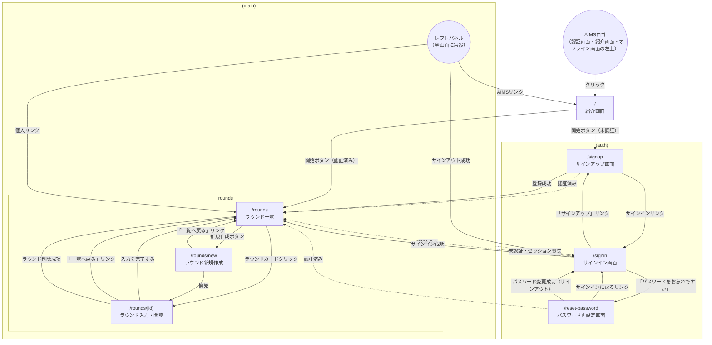

# Features

機能ごとの要件と設計を `<対象>/<機能>/` に置く。

- `requirements.md`: ユーザーから見た要求。何を満たすか。
- `design.md`: 現在の実現方法と、守るべき判断の理由・見直す条件。経緯（過去の判断、却下案、出典）は書かず、Issue / PR / git履歴を参照する。

## requirements.md の書式

要求はE2Eで検証するユーザーフローだけを書き、全行がE2Eテストを持つ。部品の振る舞い（入力、計算、表示の組み合わせ、状態遷移）は単体テストで検証し、要求に載せない。
単体テストで検証できるロジックがあることだけを理由に、要求から外さない。単体テストとE2Eは組み合わせて使い、E2Eは画面・Server Action・実バックエンドの接続と、ユーザーが期待する操作の実現を確かめる。
目的、対象画面のパス、範囲は`design.md`の概要に書く。

| ID | Given | When | Then |
| :--- | :--- | :--- | :--- |

- `ID`: `<機能>-NN`。変更しない。削除した行のIDは欠番にする。追加した行は、並び順の規則に従う位置に置き、IDは連番でなくてよい。
- `Given`: 前提。画面や対象の状態と、利用者やデータの付帯条件（例: ラウンド詳細画面で距離がない）。
- `When`: ユーザーの操作、またはオンライン復帰・オフライン化・時間経過などの外部イベント。1行につき1つ。画面を開く行は「<パス>を開く」と書く。
- `Then`: ユーザーが期待する操作が実現されているか。画面で観測できる形に限らず、システムの内部動作でなく、ユーザーから見た結果や、ユーザーにできることとして書く。主語に応じて能動態と受動態を使い分ける（例: 「ダイアログが閉じられる」「ラウンドが削除されない」「再度サインインできる」）。結果が複数あるときは` `で区切り、テスト名では「、」でつなぐ。
- 行は正常系、境界、異常系の順に並べ、E2Eテストの順序と一致させる。
- E2Eテストは要求の1行につき1件とし、テスト名を `<ID>: <Given>のとき、<When>すると、<Then>` の形にし、要求の文を読みやすくつないで書く。「Given」「When」「Then」の語は書かない。結果に「〜すると」などの行動や条件を混ぜない。Givenが行動から自明なときは省いてよい（例: 「背景をクリックすると、ラウンド削除確認ダイアログを閉じられる」）。Whenに時間を進める操作を含めてよい。
- 入力検証と送信失敗のエラー表示は、機能ごとに代表1件を要求に置く。代表であることが分かるよう「エラーメッセージが表示される」をThenとし、E2Eの本文に代表例であるコメントを置く。個別の検証規則は単体テストで網羅する。
- 共通部品（確認ダイアログ、メニューなど）の挙動は、各機能の画面が正しく使っていることをその機能で検証する。共通部品であることを理由に省かない。
- 同じ分岐を検出する重複する行は、代表1行にまとめる。
- 要求から外す行は、外す理由と、代表の行ID・単体テストの場所を、同じPRの説明に記録する。
- 実装済みで要求にない振る舞いのうち、ユーザーから観測できるものは、確認のうえ要求に追加する。

## design.md の書式

見出しは次の順で、該当しない節は省く。分量の目安は50〜80行。

1. `概要`: 方式の要点と最重要の判断（3〜5行）。
2. `画面と状態`: 状態遷移表。「要求」列にrequirementsのIDを書いて対応づける。
3. `構成とデータの流れ`: 責務単位のファイル一覧（1ファイル1行）と流れ。DB・RPCの契約（認可、冪等性、副作用）を現在形で書く。コードを読めば分かる詳細と行番号は書かない。
4. `設計判断`: 表 `判断 | 理由 | 見直す条件`。変更費用が高い、または一見不合理で直したくなる判断だけを載せる（目安は6〜8行）。再提案されやすい却下案は、理由欄に「〜は〜のため採らない」と1文で書く。
5. `制約と未対応`: 現在の既知の制約と、扱っていない範囲。

- 現在の設計だけを書く。後で覆された判断、「不明な点」、記録がない却下案は書かない。ただし、戻すと同じ問題が再発する判断は、理由欄に「〜のため〜をやめた」と1文で残す。
- 出典 `#N` は、「制約と未対応」の未解決Issueと、変更前に読むべき根拠がある場合（`詳細: #N`）に限り、1文書0〜3件とする。
- 設計が変わったら、同じPRで該当節を更新し、古い記述を残さない。

## 新機能か既存機能の修正か

判断基準は、ユーザーの目的が新しいかどうかである。

- 修正: 既存の目的を達成する手段、表示、挙動が増える・変わる場合。既存の`requirements.md`の行を追加・変更・削除し、`design.md`の該当節を更新する。
- 新機能: 独立した目的で、固有の要求の集合や画面を持つ場合。機能ディレクトリを新設する。
- 迷う場合は、既存の行を変えずに足せるなら修正、足せないなら新機能とする。

## 機能一覧

| 対象 | 機能 | ユーザーの目的 | roadmap.mdの機能 |
| :--- | :--- | :--- | :--- |
| auth | signup | アカウントを作る | Email/PW認証 |
| auth | signin | サインインする | Email/PW認証 |
| auth | password-reset | パスワードを再設定する | PW再設定 |
| auth | signout | サインアウトする | Email/PW認証 |
| rounds | start | ラウンドを始める | ラウンド・種目管理 |
| rounds | score-entry | 矢の点数を記録・修正する | 素点テンキー入力、誤入力修正・差し替え |
| rounds | setup | ラウンドの設定を変える | 基本属性入力、的（ターゲット）管理、ラウンド・種目管理 |
| rounds | preset | 構成をプリセットにして管理する | ラウンド・種目管理 |
| rounds | history | 過去のラウンドを探す | 履歴一覧・スコア詳細 |
| rounds | detail | ラウンドの成績を見る | 履歴一覧・スコア詳細 |
| rounds | completion | ラウンドの入力を完了にする | 履歴一覧・スコア詳細 |
| rounds | delete | ラウンドを削除する | 履歴一覧・スコア詳細 |
| rounds | sync | 記録を失わず同期する | RDBMS・データ基盤 |
| app | navigation | 迷わず移動する | 最小限の紹介画面、基本テーマ |
| app | offline-pwa | アプリとして入れて、オフラインでも使う | PWA・オフライン点数記録 |

## 画面遷移図

実線：ユーザー操作による遷移
破線：認証状態による自動リダイレクト（入口のガードと、表示中のセッション喪失の検知）

