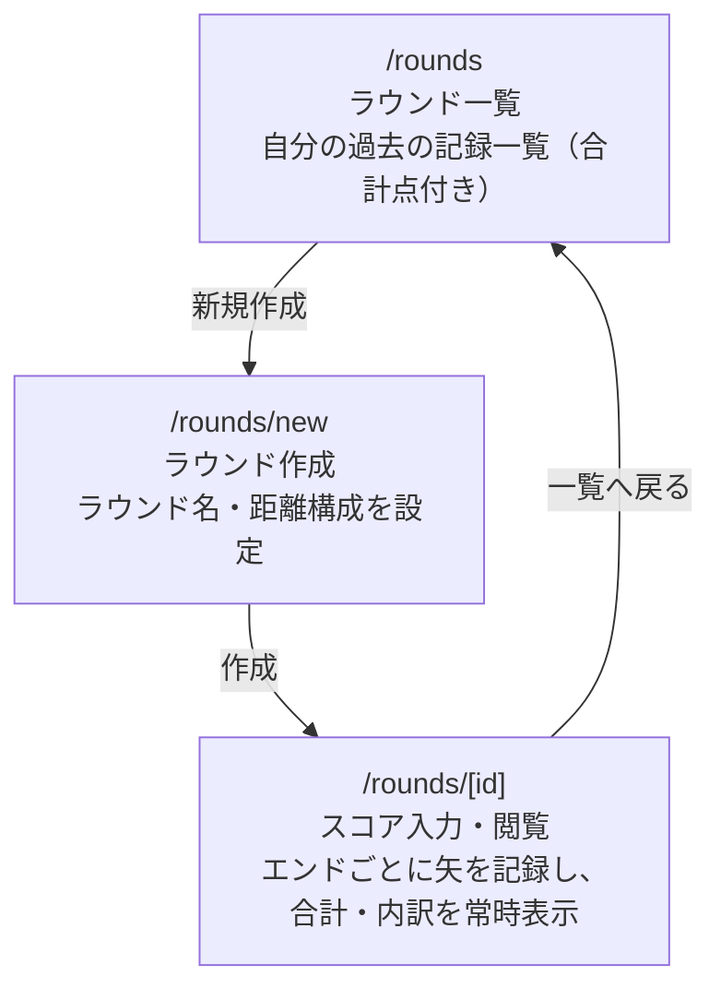

# Screen Flow (画面遷移図)

MVPスコープ（個人のスコア記録のコア体験）における画面遷移。チーム招待・認証プロバイダ設定・弓具詳細入力などの周辺機能はスコープ外とし、[`erd.md`](erd.md)で確定済みの5テーブル構成（`users` / `rounds` / `round_users` / `distances` / `shots`）を前提とする。

## 画面一覧

| Route | 画面 | 概要 |
| :--- | :--- | :--- |
| `/rounds` | ラウンド一覧 | 自分が`round_users`に属するラウンドを一覧表示（日付・ラウンド名・合計点）。カード自体がサマリーを兼ねる |
| `/rounds/new` | ラウンド作成 | ラウンド名（個人が自由に付けるタイトル。例: 第2回紅白戦）と距離構成（距離 / 総エンド数 / エンドあたりの本数）を設定し、`rounds`と`distances`を作成 |
| `/rounds/[id]` | スコア入力・閲覧 | エンドごとにテンキーで矢を入力し`shots`をupsert。合計点・X/10カウント・エンド別内訳を常に表示し、独立したサマリー専用画面は設けない |

## スコープ外（将来対応）

- `round_users`のロール（editor / viewer）をユーザー自身が変更・招待するUI
- 複数認証プロバイダの連携設定
- 弓具・環境（リムボルト、ティラー差等）の詳細入力
