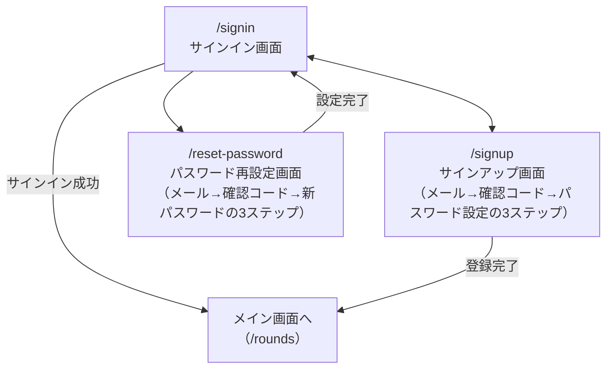
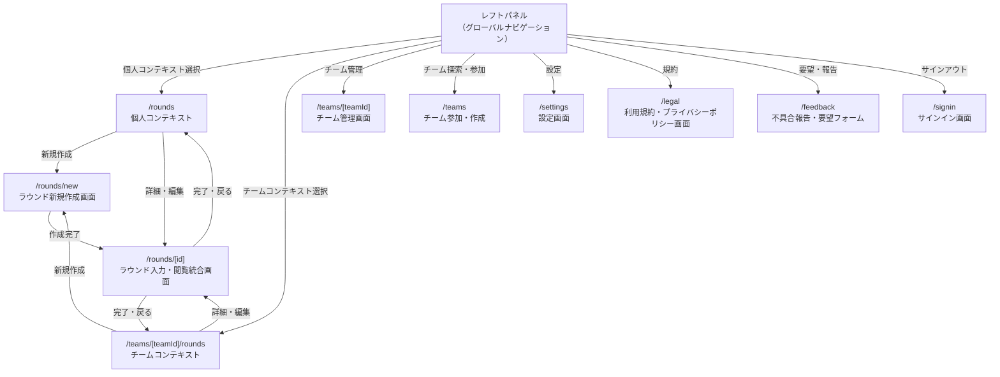
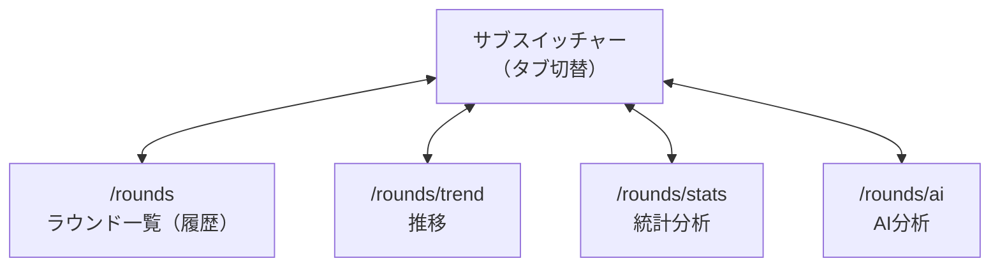
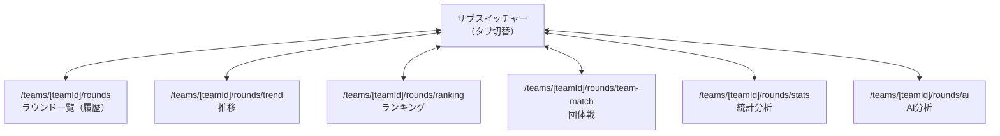
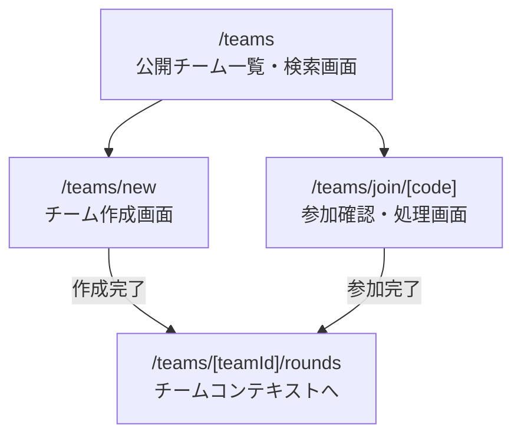

# Screen Flow (画面遷移図)

## 認証フロー

各ステップは同一URL内のクライアント側の状態遷移であり、ステップごとに別URLは持たない（実装済みの`/signup`と同じパターン）。

## メイン画面遷移（レフトパネル起点）

`/rounds`・`/teams/[teamId]/rounds`のタブ構成は後述の「個人コンテキストのタブ構成」「チームコンテキストのタブ構成」を参照。`/teams`配下のチーム参加・作成の詳細は「チーム参加・作成」を参照。

## 個人コンテキストのタブ構成

## チームコンテキストのタブ構成

## チーム参加・作成

## 画面一覧

| Route | 画面 | 概要 |
| :--- | :--- | :--- |
| `/` | ルート | 認証状態に応じて`/rounds`または`/signin`へリダイレクト（未実装。現状は静的なランディング表示） |
| `/signin` | サインイン画面 | サインイン。`/signup`への導線を持つ（実装済み） |
| `/signup` | サインアップ画面 | メール送信→確認コード入力→パスワード設定の3ステップ（同一URL内、実装済み） |
| `/reset-password` | パスワード再設定画面 | メール送信→確認コード入力→新パスワード設定の3ステップ（同一URL内。`/signup`と同じパターンで実装予定） |
| `/rounds` | ラウンド一覧（個人） | 個人コンテキストのラウンド一覧（履歴） |
| `/rounds/trend` | 推移（個人） | 個人コンテキストの得点推移グラフ |
| `/rounds/stats` | 統計分析（個人） | 個人コンテキストの統計分析 |
| `/rounds/ai` | AI分析（個人） | 個人コンテキストのAI分析 |
| `/rounds/new` | ラウンド作成 | ラウンド名・距離構成を設定し、`rounds`と`distances`を作成。個人・チーム両コンテキストで共用 |
| `/rounds/[id]` | ラウンド入力・閲覧の統合画面 | コンテキストに依存しない共通の着地点。エンドごとに矢を記録し、合計・内訳を常時表示。独立したサマリー専用画面は設けない |
| `/teams/[teamId]/rounds` | ラウンド一覧（チーム） | チームコンテキストのラウンド一覧（履歴） |
| `/teams/[teamId]/rounds/trend` | 推移（チーム） | チームコンテキストの得点推移グラフ |
| `/teams/[teamId]/rounds/ranking` | ランキング（チーム） | チームコンテキストのランキング |
| `/teams/[teamId]/rounds/team-match` | 団体戦（チーム） | チームコンテキストの団体戦機能 |
| `/teams/[teamId]/rounds/stats` | 統計分析（チーム） | チームコンテキストの統計分析 |
| `/teams/[teamId]/rounds/ai` | AI分析（チーム） | チームコンテキストのAI分析 |
| `/teams/[teamId]` | チーム管理画面 | チーム名・公開設定・招待コード再発行、メンバー一覧の閲覧・権限変更・追放（editorのみ） |
| `/teams` | 公開チーム一覧・検索画面 | チーム参加・作成の起点。検索して参加、または`/teams/new`・`/teams/join/[code]`へ |
| `/teams/new` | チーム作成画面 | チーム名・公開設定を入力してチームを作成 |
| `/teams/join/[code]` | 招待コード参加確認・処理画面 | 招待コードを（URLパラメータまたは`/teams`からの入力で）受け取り、確認のうえチームに参加 |
| `/settings` | 設定画面 | プロフィール・メール変更・アカウント削除・テーマ（ダークモード・アクセントカラー）・通知・言語等を1画面に集約 |
| `/legal` | 利用規約・プライバシーポリシー画面 | 規約・個人情報保護方針の表示 |
| `/feedback` | 不具合報告・要望フォーム | バグ報告・要望の送信 |

レフトパネルはURLを持たず、各画面上のオーバーレイとして開閉する状態であり、独立した画面ではない。各画面内のボタン配置・レイアウトは[feature-map.md](feature-map.md)を参照。
