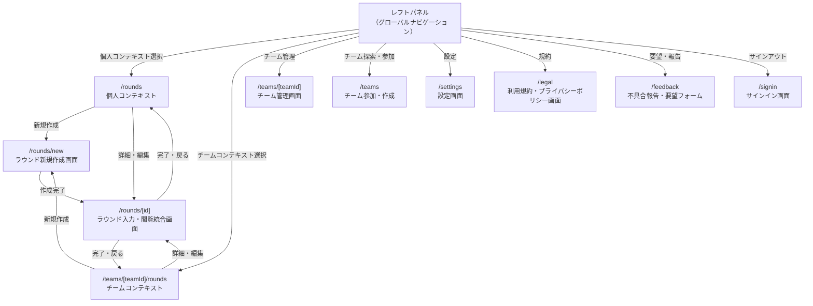
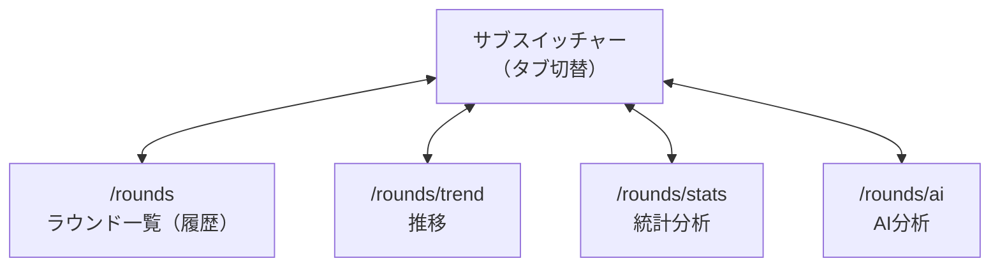
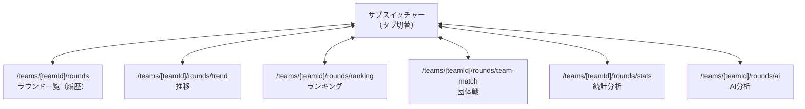
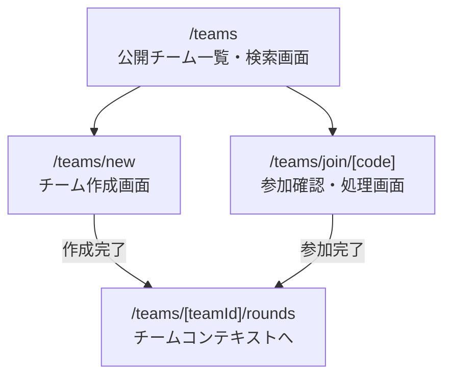

# Screen Flow (画面遷移図)

画面ごとの詳細・実装状況はfeature-map.mdを参照。

## 認証フロー

各ステップは同一URL内のクライアント側の状態遷移であり、ステップごとに別URLは持たない（`/signup`と同じパターン）。

## メイン画面遷移（レフトパネル起点）

`/rounds`・`/teams/[teamId]/rounds`のタブ構成は後述の「個人コンテキストのタブ構成」「チームコンテキストのタブ構成」を参照。`/teams`配下のチーム参加・作成の詳細は「チーム参加・作成」を参照。

## 個人コンテキストのタブ構成

## チームコンテキストのタブ構成

## チーム参加・作成

