# Screen State (画面状態遷移図)

- `〇` テスト済み
- `△` テスト漏れ
- `⚠` 実装漏れ

## `/` 紹介画面

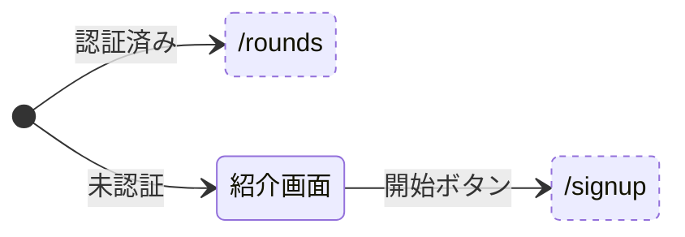

| イベント | 初期 |  | 紹介画面 |  |
| :--- | :---: | :---: | :---: | :---: |
| 未認証でアクセス | 紹介画面 | 〇 | - |  |
| 認証済みでアクセス | /rounds | 〇 | - |  |
| 開始ボタン | - |  | /signup | 〇 |

## `/signin` サインイン画面

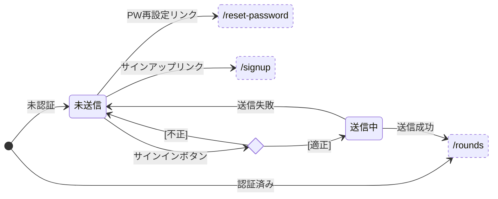

| イベント | 初期 |  | 未送信 |  | 送信中 |  |
| :--- | :---: | :---: | :---: | :---: | :---: | :---: |
| 未認証でアクセス | 未送信 | 〇 | - |  | - |  |
| 認証済みでアクセス | /rounds | 〇 | - |  | - |  |
| サインインボタン[入力不備] | - |  | （メッセージ表示） | 〇 | - |  |
| サインインボタン[captcha未完了] | - |  | （メッセージ表示） | 〇 | - |  |
| サインインボタン[エラー切り替え] | - |  | （メッセージ表示） | 〇 | - |  |
| サインインボタン[適正] | - |  | 送信中 | 〇 | 無効 | 〇 |
| PW再設定リンク | - |  | /reset-password | 〇 | - |  |
| サインアップリンク | - |  | /signup | 〇 | - |  |
| 送信失敗 | - |  | - |  | 未送信（メッセージ表示） | 〇 |
| 送信成功 | - |  | - |  | /rounds | 〇 |

## `/signup` サインアップ画面

### 初期アクセス

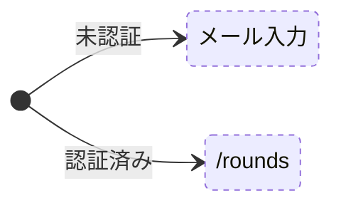

| イベント | 初期 |  |
| :--- | :---: | :---: |
| 未認証でアクセス | メール入力 | 〇 |
| 認証済みでアクセス | /rounds | 〇 |

### メール入力

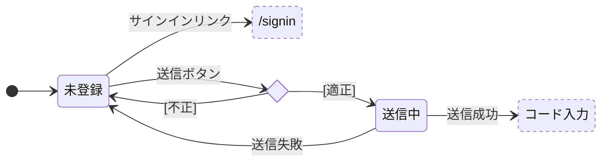

| イベント | 未登録 |  | 送信中 |  |
| :--- | :---: | :---: | :---: | :---: |
| 送信ボタン[入力不備] | （メッセージ表示） | 〇 | - |  |
| 送信ボタン[captcha未完了] | （メッセージ表示） | 〇 | - |  |
| 送信ボタン[適正] | 送信中 | 〇 | 無効 | 〇 |
| サインインリンク | /signin | 〇 | - |  |
| 送信失敗[登録済みメールアドレス] | - |  | 未登録（メッセージ表示） | 〇 |
| 送信失敗 | - |  | 未登録（メッセージ表示） | 〇 |
| 送信成功[未確認メールの再送信] | - |  | コード入力 | 〇 |
| 送信成功 | - |  | コード入力 | 〇 |

### コード入力

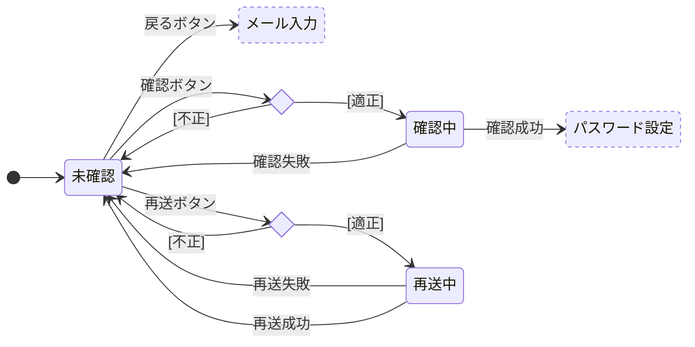

| イベント | 未確認 |  | 確認中 |  | 再送中 |  |
| :--- | :---: | :---: | :---: | :---: | :---: | :---: |
| 確認ボタン[コード未入力] | （メッセージ表示） | 〇 | - |  | - |  |
| 確認ボタン[適正] | 確認中 | 〇 | 無効 | 〇 | - |  |
| 再送ボタン[クールダウン中] | （メッセージ表示） | 〇 | - |  | - |  |
| 再送ボタン[captcha未完了] | （メッセージ表示） | 〇 | - |  | - |  |
| 再送ボタン[適正] | 再送中 | 〇 | - |  | 無効 | 〇 |
| 戻るボタン | メール入力 | 〇 | - |  | - |  |
| 確認失敗 | - |  | 未確認（メッセージ表示） | 〇 | - |  |
| 確認成功 | - |  | パスワード設定 | 〇 | - |  |
| 再送失敗 | - |  | - |  | 未確認（メッセージ表示） | 〇 |
| 再送成功 | - |  | - |  | 未確認（確認メッセージなし） | 〇 |

### パスワード設定

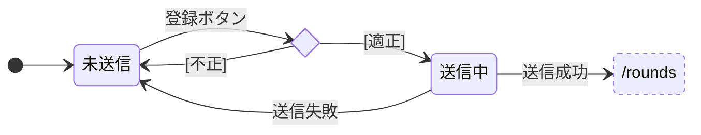

| イベント | 未送信 |  | 送信中 |  |
| :--- | :---: | :---: | :---: | :---: |
| 登録ボタン[パスワード不備] | （メッセージ表示） | 〇 | - |  |
| 登録ボタン[適正] | 送信中 | 〇 | 無効 | 〇 |
| 送信失敗 | - |  | 未送信（メッセージ表示） | 〇 |
| 送信成功 | - |  | /rounds | 〇 |

## `/reset-password` パスワード再設定画面

### 初期アクセス


| イベント | 初期 |  |
| :--- | :---: | :---: |
| 未認証でアクセス | メール入力 | 〇 |
| 認証済みでアクセス | /rounds | 〇 |

### メール入力


| イベント | 未送信 |  | 送信中 |  |
| :--- | :---: | :---: | :---: | :---: |
| 送信ボタン[入力不備] | （メッセージ表示） | 〇 | - |  |
| 送信ボタン[captcha未完了] | （メッセージ表示） | 〇 | - |  |
| 送信ボタン[適正] | 送信中 | 〇 | 無効 | 〇 |
| サインインリンク | /signin | 〇 | - |  |
| 送信失敗 | - |  | 未送信（メッセージ表示） | 〇 |
| 送信成功 | - |  | コード入力 | 〇 |

### コード入力


| イベント | 未確認 |  | 確認中 |  | 再送中 |  |
| :--- | :---: | :---: | :---: | :---: | :---: | :---: |
| 確認ボタン[コード未入力] | （メッセージ表示） | 〇 | - |  | - |  |
| 確認ボタン[適正] | 確認中 | 〇 | 無効 | 〇 | - |  |
| 再送ボタン[クールダウン中] | （メッセージ表示） | 〇 | - |  | - |  |
| 再送ボタン[captcha未完了] | （メッセージ表示） | 〇 | - |  | - |  |
| 再送ボタン[適正] | 再送中 | 〇 | - |  | 無効 | 〇 |
| 戻るボタン | メール入力 | 〇 | - |  | - |  |
| 確認失敗 | - |  | 未確認（メッセージ表示） | 〇 | - |  |
| 確認成功 | - |  | パスワード設定 | 〇 | - |  |
| 再送失敗 | - |  | - |  | 未確認（メッセージ表示） | 〇 |
| 再送成功 | - |  | - |  | 未確認（確認メッセージなし） | 〇 |

### パスワード設定

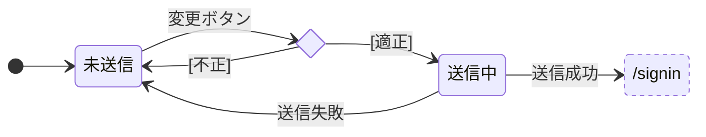

| イベント | 未送信 |  | 送信中 |  |
| :--- | :---: | :---: | :---: | :---: |
| 変更ボタン[パスワード不備] | （メッセージ表示） | 〇 | - |  |
| 変更ボタン[適正] | 送信中 | 〇 | 無効 | 〇 |
| 送信失敗 | - |  | 未送信（メッセージ表示） | 〇 |
| 送信成功 | - |  | /signin | 〇 |

## レフトパネル

### モバイル表示（`md`未満）

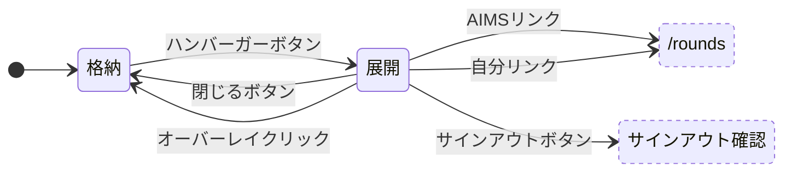

| イベント | 初期 |  | 展開 |  | 格納 |  |
| :--- | :---: | :---: | :---: | :---: | :---: | :---: |
| 初期表示 | 格納 | 〇 | - |  | - |  |
| 閉じるボタン | - |  | 格納 | 〇 | - |  |
| オーバーレイクリック | - |  | 格納 | 〇 | - |  |
| AIMSリンク | - |  | /rounds | 〇 | 無効 | 〇 |
| 自分リンク | - |  | /rounds | 〇 | 無効 | 〇 |
| サインアウトボタン | - |  | サインアウト確認 | 〇 | 無効 | 〇 |
| ハンバーガーボタン | - |  | - |  | 展開 | 〇 |

### デスクトップ表示（`md`以上）

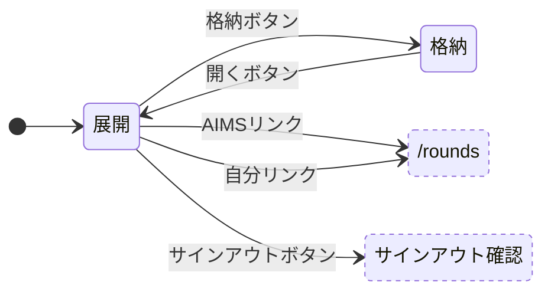

| イベント | 初期 |  | 展開 |  | 格納 |  |
| :--- | :---: | :---: | :---: | :---: | :---: | :---: |
| 初期表示 | 展開 | 〇 | - |  | - |  |
| 格納ボタン | - |  | 格納 | 〇 | - |  |
| AIMSリンク | - |  | /rounds | 〇 | 無効 | 〇 |
| 自分リンク | - |  | /rounds | 〇 | 無効 | 〇 |
| サインアウトボタン | - |  | サインアウト確認 | 〇 | 無効 | 〇 |
| 開くボタン | - |  | - |  | 展開 | 〇 |

### サインアウト確認

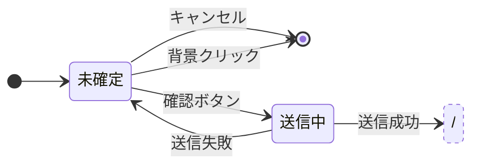

| イベント | 未確定 |  | 送信中 |  |
| :--- | :---: | :---: | :---: | :---: |
| キャンセル | ダイアログを閉じる | 〇 | 無効 | 〇 |
| 背景クリック | ダイアログを閉じる | 〇 | 無効 | 〇 |
| 確認ボタン | 送信中 | 〇 | 無効 | 〇 |
| 送信失敗 | - |  | 未確定（メッセージ表示） | 〇 |
| 送信成功 | - |  | / | 〇 |

## `/rounds` ラウンド一覧

### 初期アクセス

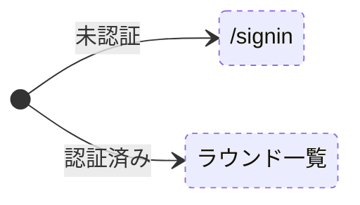

| イベント | 初期 |  |
| :--- | :---: | :---: |
| 未認証でアクセス | /signin | 〇 |
| 認証済みでアクセス | ラウンド一覧 | 〇 |

### ラウンド一覧

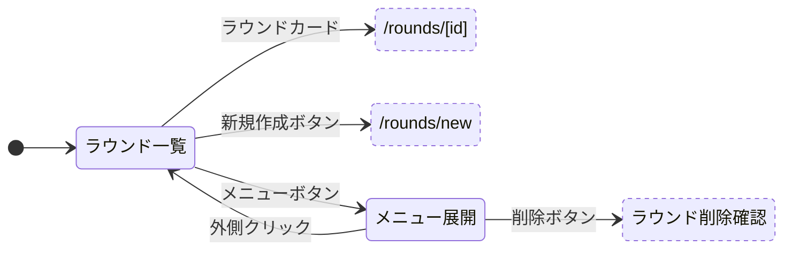

| イベント | ラウンド一覧 |  | メニュー展開 |  |
| :--- | :---: | :---: | :---: | :---: |
| ラウンドカード | /rounds/[id] | 〇 | - |  |
| 新規作成ボタン | /rounds/new | 〇 | - |  |
| メニューボタン | メニュー展開 | 〇 | - |  |
| 外側クリック | - |  | ラウンド一覧 | 〇 |
| 削除ボタン | - |  | ラウンド削除確認 | 〇 |

### ラウンド削除確認

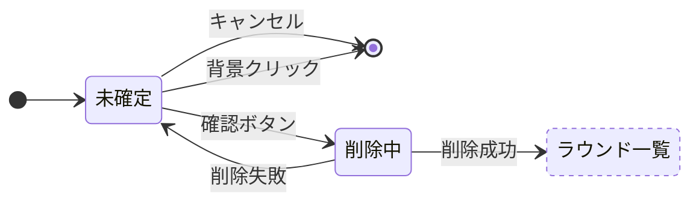

| イベント | 未確定 |  | 削除中 |  |
| :--- | :---: | :---: | :---: | :---: |
| キャンセル | ダイアログを閉じる | 〇 | 無効 | 〇 |
| 背景クリック | ダイアログを閉じる | 〇 | 無効 | 〇 |
| 確認ボタン | 削除中 | 〇 | 無効 | 〇 |
| 削除失敗 | - |  | 未確定（メッセージ表示） | 〇 |
| 削除成功 | - |  | ラウンド一覧 | 〇 |

## `/rounds/new` ラウンド新規作成

### 初期アクセス

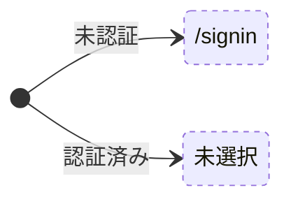

| イベント | 初期 |  |
| :--- | :---: | :---: |
| 未認証でアクセス | /signin | △ |
| 認証済みでアクセス | 未選択 | 〇 |

### プリセット一覧

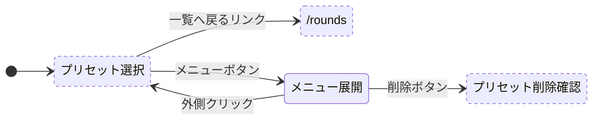

| イベント | プリセット選択 |  | メニュー展開 |  |
| :--- | :---: | :---: | :---: | :---: |
| 一覧へ戻るリンク | /rounds | 〇 | - |  |
| メニューボタン | メニュー展開 | △ | - |  |
| 外側クリック | - |  | プリセット選択 | △ |
| 削除ボタン | - |  | プリセット削除確認 | 〇 |

### プリセット選択

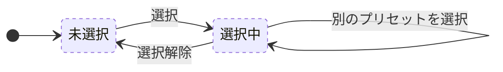

| イベント | 未選択 |  | 選択中 |  |
| :--- | :---: | :---: | :---: | :---: |
| 選択 | 選択中 | 〇 | - |  |
| 選択解除 | - |  | 未選択 | 〇 |
| 別のプリセットを選択 | - |  | 選択中 | △ |

### 未選択

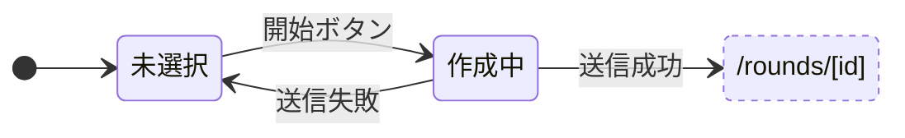

| イベント | 未選択 |  | 作成中 |  |
| :--- | :---: | :---: | :---: | :---: |
| 開始ボタン | 作成中 | 〇 | - |  |
| 送信失敗 | - |  | 未選択（メッセージ表示） | 〇 |
| 送信成功 | - |  | /rounds/[id] | 〇 |

対応事項（実装済みだが削除・修正が必要）:
- 開始ボタンの`disabled={submitting}`を、ローディングオーバーレイ＋`inert`のパターンに置き換える

### 選択中

```mermaid
stateDiagram-v2
    direction LR
    state "/rounds/[id]" as RoundDetail

    [*] --> 選択中

    選択中 --> 作成中: 開始ボタン

    作成中 --> 選択中: 送信失敗
    作成中 --> RoundDetail: 送信成功

    classDef external stroke-dasharray: 4 4
    class RoundDetail external
```

| イベント | 選択中 |  | 作成中 |  |
| :--- | :---: | :---: | :---: | :---: |
| 開始ボタン | 作成中 | 〇 | - |  |
| 送信失敗 | - |  | 選択中（メッセージ表示） | △ |
| 送信成功 | - |  | /rounds/[id] | 〇 |

### プリセット削除確認

```mermaid
stateDiagram-v2
    direction LR
    state "プリセット選択" as PresetSelect

    [*] --> 未確定

    未確定 --> [*]: キャンセル
    未確定 --> [*]: 背景クリック
    未確定 --> 削除中: 確認ボタン

    削除中 --> 未確定: 削除失敗
    削除中 --> PresetSelect: 削除成功

    classDef external stroke-dasharray: 4 4
    class PresetSelect external
```

| イベント | 未確定 |  | 削除中 |  |
| :--- | :---: | :---: | :---: | :---: |
| キャンセル | ダイアログを閉じる | 〇 | 無効 | △ |
| 背景クリック | ダイアログを閉じる | △ | 無効 | △ |
| 確認ボタン | 削除中 | 〇 | 無効 | 〇 |
| 削除失敗 | - |  | 未確定（メッセージ表示） | 〇 |
| 削除成功[選択中のプリセットを削除] | - |  | プリセット選択（未選択） | △ |
| 削除成功 | - |  | プリセット選択 | 〇 |
