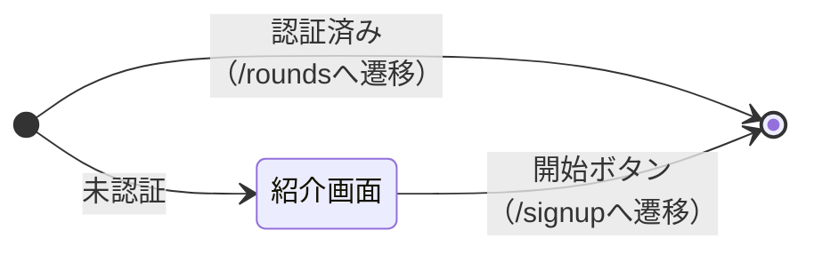

# Screen State (画面状態遷移図)

- `〇` テスト済み
- `△` テスト漏れ
- `⚠` 実装漏れ

## `/` 紹介画面

| イベント | 初期 | 紹介画面 |
| :--- | :---: | :---: |
| 未認証でアクセス | 紹介画面 〇 | - |
| 認証済みでアクセス | /roundsへ遷移 〇 | - |
| 開始ボタン | - | /signupへ遷移 〇 |

## `/signin` サインイン画面

（未着手）

## `/signup` サインアップ画面

（未着手）

## `/reset-password` パスワード再設定画面

（未着手）

## レフトパネル

（未着手）

## `/rounds` ラウンド一覧

（未着手）

## `/rounds/new` ラウンド新規作成

（未着手）
