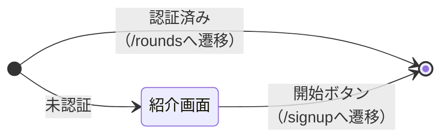
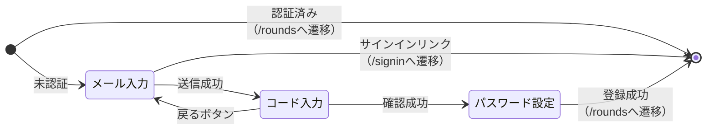
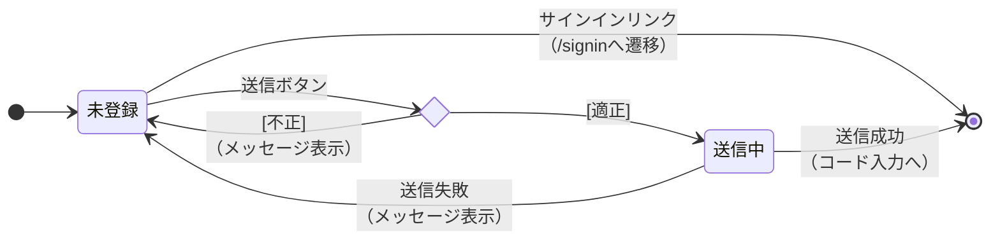
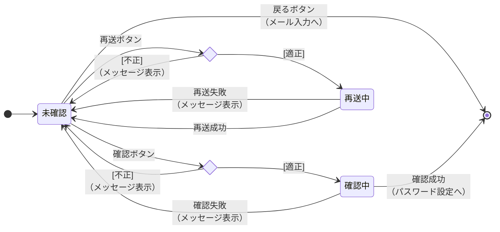
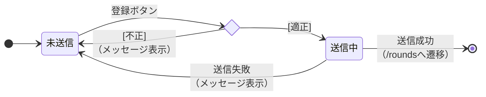

# Screen State (画面状態遷移図)

- `〇` テスト済み
- `△` テスト漏れ
- `⚠` 実装漏れ

## `/` 紹介画面

| イベント | 初期 |  | 紹介画面 |  |
| :--- | :---: | :---: | :---: | :---: |
| 未認証でアクセス | 紹介画面 | 〇 | - |  |
| 認証済みでアクセス | /roundsへ遷移 | 〇 | - |  |
| 開始ボタン | - |  | /signupへ遷移 | 〇 |

## `/signin` サインイン画面

| イベント | 初期 |  | 未送信 |  | 送信中 |  |
| :--- | :---: | :---: | :---: | :---: | :---: | :---: |
| 未認証でアクセス | 未送信 | 〇 | - |  | - |  |
| 認証済みでアクセス | /roundsへ遷移 | 〇 | - |  | - |  |
| サインインボタン[入力不備] | - |  | 未送信（メッセージ表示） | 〇 | - |  |
| サインインボタン[captcha未完了] | - |  | 未送信（メッセージ表示） | 〇 | - |  |
| サインインボタン[適正] | - |  | 送信中 | 〇 | - |  |
| PW再設定リンク | - |  | /reset-passwordへ遷移 | 〇 | - |  |
| サインアップリンク | - |  | /signupへ遷移 | 〇 | - |  |
| 背景操作 | - |  | - |  | 無効 | 〇 |
| 送信失敗 | - |  | - |  | 未送信（メッセージ表示） | 〇 |
| 送信成功 | - |  | - |  | /roundsへ遷移 | 〇 |

## `/signup` サインアップ画面

### ステップ間遷移

| イベント | 初期 |  |
| :--- | :---: | :---: |
| 未認証でアクセス | メール入力 | 〇 |
| 認証済みでアクセス | /roundsへ遷移 | ⚠ |

### メール入力

| イベント | 未登録 |  | 送信中 |  |
| :--- | :---: | :---: | :---: | :---: |
| 送信ボタン[captcha未完了] | 未登録（メッセージ表示） | ⚠ | - |  |
| 送信ボタン[入力不備] | 未登録（メッセージ表示） | ⚠ | - |  |
| 送信ボタン[適正] | 送信中 | 〇 | - |  |
| サインインリンク | /signinへ遷移 | 〇 | - |  |
| 背景操作 | - |  | 無効 | ⚠ |
| 送信失敗[登録済みメールアドレス] | - |  | 未登録（メッセージ表示） | 〇 |
| 送信失敗 | - |  | 未登録（メッセージ表示） | 〇 |
| 送信成功 | - |  | コード入力へ | 〇 |

対応事項（実装済みだが削除・修正が必要）:
- 送信ボタンの`disabled={!captchaToken}`を削除する。常に押せる状態にし、captcha未完了時はメッセージ表示に切り替える
- 送信中はフォーム全体（送信ボタン・サインインリンク）を「送信中です」と表示するローディングオーバーレイで覆い、その範囲を`inert`にする（`/rounds`・サインアウト確認ダイアログのモーダルと同じパターン）

### コード入力

| イベント | 未確認 |  | 確認中 |  | 再送中 |  |
| :--- | :---: | :---: | :---: | :---: | :---: | :---: |
| 確認ボタン[コード未入力] | 未確認（メッセージ表示） | ⚠ | - |  | - |  |
| 確認ボタン[適正] | 確認中 | 〇 | - |  | - |  |
| 再送ボタン[クールダウン中] | 未確認（メッセージ表示） | ⚠ | - |  | - |  |
| 再送ボタン[captcha未完了] | 未確認（メッセージ表示） | ⚠ | - |  | - |  |
| 再送ボタン[適正] | 再送中 | △ | - |  | - |  |
| 戻るボタン | メール入力へ | 〇 | - |  | - |  |
| 背景操作（確認ボタン再クリック・戻るボタン） | - |  | 無効 | ⚠ | - |  |
| 背景操作（再送ボタン再クリック・戻るボタン） | - |  | - |  | 無効 | ⚠ |
| 確認失敗 | - |  | 未確認（メッセージ表示） | 〇 | - |  |
| 確認成功 | - |  | パスワード設定へ | 〇 | - |  |
| 再送失敗 | - |  | - |  | 未確認（メッセージ表示） | △ |
| 再送成功 | - |  | - |  | 未確認（確認メッセージなし） | △ |

対応事項（実装済みだが削除・修正が必要）:
- 再送ボタンの`disabled={resendCooldown > 0 || !captchaToken}`を削除する。常に押せる状態にし、クールダウン中／captcha未完了時はメッセージ表示に切り替える（確認ボタンは元々disabled属性なし）
- 処理中はステップ全体（確認ボタン・再送ボタン・戻るボタン）をローディングオーバーレイで覆い、その範囲を`inert`にする（`/rounds`・サインアウト確認ダイアログのモーダルと同じパターン）

### パスワード設定

| イベント | 未送信 |  | 送信中 |  |
| :--- | :---: | :---: | :---: | :---: |
| 登録ボタン[パスワード不備] | 未送信（メッセージ表示） | ⚠ | - |  |
| 登録ボタン[適正] | 送信中 | 〇 | 無効 | ⚠ |
| 送信失敗 | - |  | 未送信（メッセージ表示） | 〇 |
| 送信成功 | - |  | /roundsへ遷移 | 〇 |

対応事項（実装済みだが削除・修正が必要）:
- `<SignInLink />`を削除する。この画面に来た時点で`verifyOtp`により認証セッションが確立済みのため、押しても正常にサインインできない機能しないリンクになっている
- 送信中はローディングオーバーレイで覆い、その範囲を`inert`にする（`/rounds`・サインアウト確認ダイアログのモーダルと同じパターン）
- `setPassword()`（Server Action内の`updateUser()`＋`redirect()`）を、`/signin`の`signIn()`と同じ理由で通常のクライアント側`fetch()`（`supabase.auth.updateUser()`を直接呼ぶ）＋`router.push()`に置き換える。`/signin`ではこの構成が「送信中に別リンクへ移動すると、後から成功した`redirect()`が遷移を横取りする」レースコンディションを引き起こすことが確認され、fetch化で解消した。ただしこの画面自体でその不具合が実際に確認されたわけではなく、`/signin`と同じ構造を持つことによる予防的な統一。対応要否は`/signin`での知見を踏まえて判断する

## `/reset-password` パスワード再設定画面

（未着手）

## レフトパネル

（未着手）

## `/rounds` ラウンド一覧

（未着手）

## `/rounds/new` ラウンド新規作成

（未着手）
