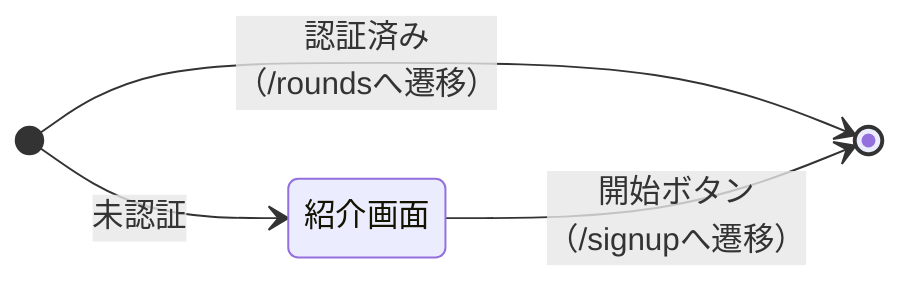
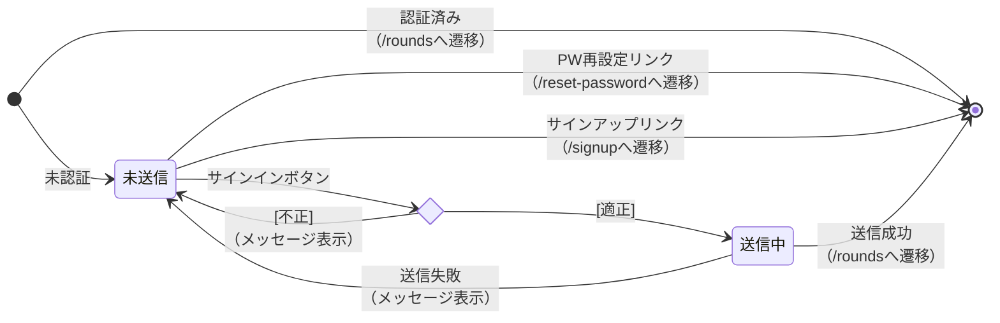

# Screen State (画面状態遷移図)

- `〇` テスト済み
- `△` テスト漏れ
- `⚠` 実装漏れ

## `/` 紹介画面

| イベント | 初期 |  | 紹介画面 |  |
| :--- | :---: | :---: | :---: | :---: |
| 未認証でアクセス | 紹介画面 | 〇 | - |  |
| 認証済みでアクセス | /roundsへ遷移 | 〇 | - |  |
| 開始ボタン | - |  | /signupへ遷移 | 〇 |

## `/signin` サインイン画面

| イベント | 初期 |  | 未送信 |  | 送信中 |  |
| :--- | :---: | :---: | :---: | :---: | :---: | :---: |
| 未認証でアクセス | 未送信 | 〇 | - |  | - |  |
| 認証済みでアクセス | /roundsへ遷移 | 〇 | - |  | - |  |
| サインインボタン[入力不備] | - |  | 未送信（メッセージ表示） | 〇 | - |  |
| サインインボタン[captcha未完了] | - |  | 未送信（メッセージ表示） | 〇 | - |  |
| サインインボタン[適正] | - |  | 送信中 | 〇 | - |  |
| PW再設定リンク | - |  | /reset-passwordへ遷移 | 〇 | - |  |
| サインアップリンク | - |  | /signupへ遷移 | 〇 | - |  |
| 背景操作 | - |  | - |  | 無効 | 〇 |
| 送信失敗 | - |  | - |  | 未送信（メッセージ表示） | 〇 |
| 送信成功 | - |  | - |  | /roundsへ遷移 | 〇 |

## `/signup` サインアップ画面

（未着手）

## `/reset-password` パスワード再設定画面

（未着手）

## レフトパネル

（未着手）

## `/rounds` ラウンド一覧

（未着手）

## `/rounds/new` ラウンド新規作成

（未着手）
